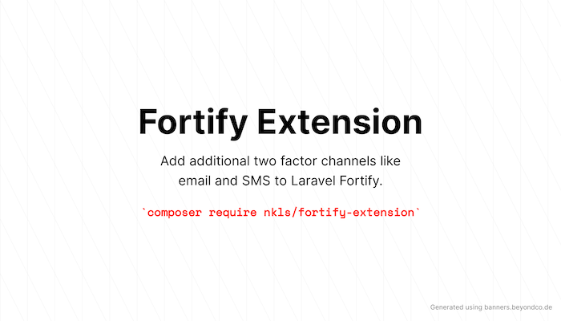

<p align="center"></p>

# Fortify Extension

This package adds SMS and email to Laravel Fortify's two factor authentication.

## Installation

You can install this package via Composer:

```sh
composer require nkls/fortify-extension
```

```sh
php artisan vendor:publish --provider="Nkls\FortifyExtension\FortifyExtensionServiceProvider"
```

### Setup

```php
'features' => [
    Features::twoFactorAuthentication([
        'confirm' => true,
        'confirmPassword' => true,
        'useAdditionalChannels' => true,
    ]),
],
```

## Usage

tbd

## Security Vulnerabilities

If you discover a security vulnerability within the package, please reach out to me. All security vulnerabilities will be promptly addressed.

## License

The fortify-extension package is open-sourced software licensed under the [MIT license](https://opensource.org/licenses/MIT).
